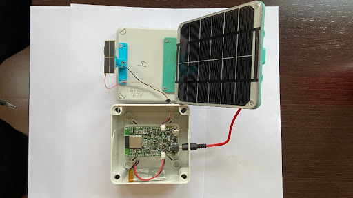

# Solar Node

This is a kikad project for a pcb of a IoT node that can meassure Solar Irradiation
and send it truogh a wifi conection to a cloud service.

The node ins based on an ESP32, which provides the microcontroller and the wifi
radio. The pcb adds a power supply system and a solar irradiance meassurement
circuit.

The power supply system is composed of a Lipo battery, a battery charger, a 6W
solar pannel and a set of regulators: one for the esp, and two for external
devices that can be swithced on or off from the ESP firmware.

The solar irradiance meassurement circuit is composed of a transimpedance
amplifier and a small mono-chrystalline fotovoltaic cell, that is kept in short
circuit by the transimpedance amplifier, which transforms the current generated
by the cell into a voltage that can be read using one of the ADC channels of the
ESP32. Bellow you can see an image of a complete node build from this pcb. 

